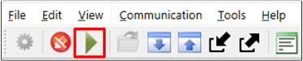
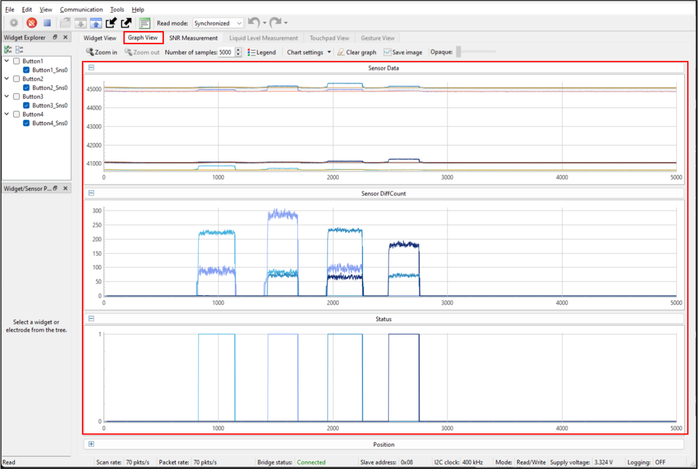
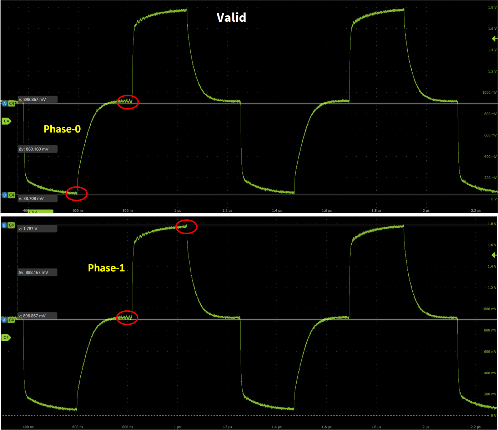
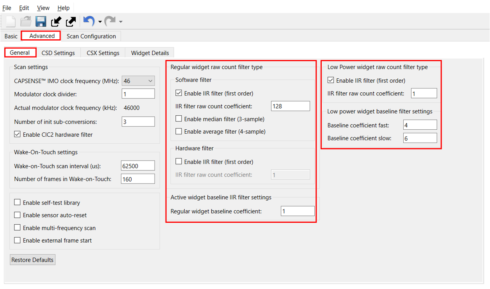
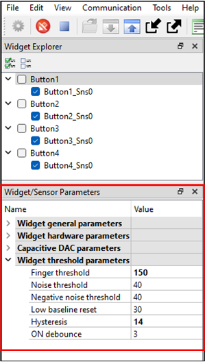

# PSOC&trade; 4: MSCLP CAPSENSE&trade; hover touch

This code example demonstrates an implementation of hover-touch sensor application using CAPSENSE&trade; middleware. Hover-touch sensor is a type of capacitive touch button with an overlay elevated from the PCB. This implementation eliminates the need for bridging the gap with a conductive material, such as a spring or conductive foam.
Additionally, this code example also explains how to manually tune the hover-touch sensor for optimal performance, taking into account parameters like overlay elevation distance, button separation, and response time.

[View this README on GitHub.](https://github.com/Infineon/mtb-example-psoc4-msclp-hover-touch)

[Provide feedback on this code example.](https://yourvoice.infineon.com/jfe/form/SV_1NTns53sK2yiljn?Q_EED=eyJVbmlxdWUgRG9jIElkIjoiQ0UyNDEwNjgiLCJTcGVjIE51bWJlciI6IjAwMi00MTA2OCIsIkRvYyBUaXRsZSI6IlBTT0MmdHJhZGU7IDQ6IE1TQ0xQIENBUFNFTlNFJnRyYWRlOyBob3ZlciB0b3VjaCIsInJpZCI6ImxvaGl0YWtzaC5yYXdhdEBpbmZpbmVvbi5jb20iLCJEb2MgdmVyc2lvbiI6IjMuMC4wIiwiRG9jIExhbmd1YWdlIjoiRW5nbGlzaCIsIkRvYyBEaXZpc2lvbiI6Ik1DRCIsIkRvYyBCVSI6IklDVyIsIkRvYyBGYW1pbHkiOiJQU09DIn0=)


## Requirements

- [ModusToolbox&trade;](https://www.infineon.com/modustoolbox) v3.7 or later (tested with v3.7)

   > **Note:** This code example requires ModusToolbox&trade; v3.7 and is not backward compatible with older versions.

- [ModusToolbox&trade; CAPSENSE&trade; and Multi-Sense Pack](https://softwaretools.infineon.com/tools/com.ifx.tb.tool.modustoolboxpackmultisense) for ModusToolbox&trade; v3.7 or later

   > **Note:** This pack contains CAPSENSE&trade; Configurator,  CAPSENSE&trade; Tuner and Sensor designer tools.

- Board support package (BSP) minimum required version: 3.3.0
- Programming language: C
- Associated parts: [PSOC&trade; 4000T](https://www.infineon.com/002-33949) and [PSOC&trade; 4100T Plus](https://www.infineon.com/002-39671)


## Supported toolchains (make variable 'TOOLCHAIN')

- GNU Arm&reg; Embedded Compiler v11.3.1 (`GCC_ARM`) – Default value of `TOOLCHAIN`
- Arm&reg; Compiler v6.22 (`ARM`)
- IAR C/C++ Compiler v9.50.2 (`IAR`)


## Supported kits (make variable 'TARGET')

- [PSOC&trade; 4000T Multi-Sense Prototyping Kit](https://www.infineon.com/CY8CPROTO-040T-MS) (`CY8CPROTO-040T-MS`) – Default value of `TARGET`
- [PSOC&trade; 4100T Plus CAPSENSE&trade; Prototyping Kit](https://www.infineon.com/CY8CPROTO-041TP) (`CY8CPROTO-041TP`)


## Hardware setup

This example uses the board's default configuration. See the kit user guide to configure the hardware to operate at the required operating voltage. To setup the device VDDA supply voltage, see the section [Set up the VDDA supply voltage and debug mode in Device Configurator](#set-up-the-vdda-supply-voltage-and-debug-mode-in-device-configurator).

This application is tuned to perform optimally at the default voltage. However, you can observe the basic functionality at other supported voltages.

**Table 1. Kit user guide and supported voltages**

   Kit | User guide  | 1.8 V | 3.3 V | 5 V
   :-------- |:----------- |:----------- |:----- |:-----
   CY8CPROTO-040T-MS| [CY8CPROTO-040T-MS PSOC&trade; 4000T Multi-Sense Prototyping Kit guide](https://www.infineon.com/002-40406)  | Yes | Yes* | Yes
   CY8CPROTO-041TP| [CY8CPROTO-041TP PSOC&trade; 4100T Plus CAPSENSE&trade; Prototyping Kit guide](https://www.infineon.com/002-40273) | Yes | Yes | Yes*

   <br>
    
   Yes* - Kit default operating voltage.


## Software setup

See the [ModusToolbox&trade; tools package installation guide](https://www.infineon.com/ModusToolboxInstallguide) for information about installing and configuring the tools package.


This example requires no additional software or tools.


## Using the code example


### Create the project

The ModusToolbox&trade; tools package provides the Project Creator as both a GUI tool and a command line tool.

<details><summary><b>Use Project Creator GUI</b></summary>

1. Open the Project Creator GUI tool

   There are several ways to do this, including launching it from the dashboard or from inside the Eclipse IDE. For more details, see the [Project Creator user guide](https://www.infineon.com/ModusToolboxProjectCreator) (locally available at *{ModusToolbox&trade; install directory}/tools_{version}/project-creator/docs/project-creator.pdf*)

2. On the **Choose Board Support Package (BSP)** page, select a kit supported by this code example. See [Supported kits](#supported-kits-make-variable-target)

   > **Note:** To use this code example for a kit not listed here, you may need to update the source files. If the kit does not have the required resources, the application may not work

3. On the **Select Application** page:

   a. Select the **Applications(s) Root Path** and the **Target IDE**

      > **Note:** Depending on how you open the Project Creator tool, these fields may be pre-selected for you

   b. Select this code example from the list by enabling its check box

      > **Note:** You can narrow the list of displayed examples by typing in the filter box

   c. (Optional) Change the suggested **New Application Name** and **New BSP Name**

   d. Click **Create** to complete the application creation process

</details>


<details><summary><b>Use Project Creator CLI</b></summary>

The 'project-creator-cli' tool can be used to create applications from a CLI terminal or from within batch files or shell scripts. This tool is available in the *{ModusToolbox&trade; install directory}/tools_{version}/project-creator/* directory.

Use a CLI terminal to invoke the 'project-creator-cli' tool. On Windows, use the command-line 'modus-shell' program provided in the ModusToolbox&trade; installation instead of a standard Windows command-line application. This shell provides access to all ModusToolbox&trade; tools. You can access it by typing "modus-shell" in the search box in the Windows menu. In Linux and macOS, you can use any terminal application.

The following example clones the "[mtb-example-psoc4-msclp-hover-touch](https://github.com/Infineon/mtb-example-psoc4-msclp-hover-touch)" application with the desired name "HoverTouch" configured for the *CY8CPROTO-040T-MS* BSP into the specified working directory, *C:/mtb_projects*:

   ```
   project-creator-cli --board-id CY8CPROTO-040T-MS --app-id mtb-example-psoc4-msclp-hover-touch-4 --user-app-name HoverTouch --target-dir "C:/mtb_projects"
   ```


The 'project-creator-cli' tool has the following arguments:

Argument | Description | Required/optional
---------|-------------|-----------
`--board-id` | Defined in the <id> field of the [BSP](https://github.com/Infineon?q=bsp-manifest&type=&language=&sort=) manifest | Required
`--app-id`   | Defined in the <id> field of the [CE](https://github.com/Infineon?q=ce-manifest&type=&language=&sort=) manifest | Required
`--target-dir`| Specify the directory in which the application is to be created if you prefer not to use the default current working directory | Optional
`--user-app-name`| Specify the name of the application if you prefer to have a name other than the example's default name | Optional

<br>

> **Note:** The project-creator-cli tool uses the `git clone` and `make getlibs` commands to fetch the repository and import the required libraries. For details, see the "Project creator tools" section of the [ModusToolbox&trade; tools package user guide](https://www.infineon.com/ModusToolboxUserGuide) (locally available at {ModusToolbox&trade; install directory}/docs_{version}/mtb_user_guide.pdf).

</details>


### Open the project

After the project has been created, you can open it in your preferred development environment.


<details><summary><b>Eclipse IDE</b></summary>

If you opened the Project Creator tool from the included Eclipse IDE, the project will open in Eclipse automatically.

For more details, see the [Eclipse IDE for ModusToolbox&trade; user guide](https://www.infineon.com/MTBEclipseIDEUserGuide) (locally available at *{ModusToolbox&trade; install directory}/docs_{version}/mt_ide_user_guide.pdf*).

</details>


<details><summary><b>Visual Studio (VS) Code</b></summary>

Launch VS Code manually, and then open the generated *{project-name}.code-workspace* file located in the project directory.

For more details, see the [Visual Studio Code for ModusToolbox&trade; user guide](https://www.infineon.com/MTBVSCodeUserGuide) (locally available at *{ModusToolbox&trade; install directory}/docs_{version}/mt_vscode_user_guide.pdf*).

</details>


<details><summary><b>Arm&reg; Keil&reg; µVision&reg;</b></summary>

Double-click the generated *{project-name}.cprj* file to launch the Keil&reg; µVision&reg; IDE.

For more details, see the [Arm&reg; Keil&reg; µVision&reg; for ModusToolbox&trade; user guide](https://www.infineon.com/MTBuVisionUserGuide) (locally available at *{ModusToolbox&trade; install directory}/docs_{version}/mt_uvision_user_guide.pdf*).

</details>


<details><summary><b>IAR Embedded Workbench</b></summary>

Open IAR Embedded Workbench manually, and create a new project. Then select the generated *{project-name}.ipcf* file located in the project directory.

For more details, see the [IAR Embedded Workbench for ModusToolbox&trade; user guide](https://www.infineon.com/MTBIARUserGuide) (locally available at *{ModusToolbox&trade; install directory}/docs_{version}/mt_iar_user_guide.pdf*).

</details>


<details><summary><b>Command line</b></summary>

If you prefer to use the CLI, open the appropriate terminal, and navigate to the project directory. On Windows, use the command-line 'modus-shell' program; on Linux and macOS, you can use any terminal application. From there, you can run various `make` commands.

For more details, see the [ModusToolbox&trade; tools package user guide](https://www.infineon.com/ModusToolboxUserGuide) (locally available at *{ModusToolbox&trade; install directory}/docs_{version}/mtb_user_guide.pdf*).

</details>


## Operation

1. Connect the board to your PC using the provided USB cable through the KitProg3 USB connector

   **Figure 1. Connecting the [CY8CPROTO-040T-MS](https://www.infineon.com/CY8CPROTO-040T) kit with the PC**
   
      

2. Program the board using one of the following:

   <details><summary><b>Using Eclipse IDE</b></summary>

      1. Select the application project in the Project Explorer

      2. In the **Quick Panel**, scroll down, and click **\<Application Name> Program (KitProg3_MiniProg4)**
   </details>


   <details><summary><b>In other IDEs</b></summary>

   Follow the instructions in your preferred IDE.

   </details>


   <details><summary><b>Using CLI</b></summary>

     From the terminal, execute the `make program` command to build and program the application using the default toolchain to the default target. The default toolchain is specified in the application's Makefile but you can override this value manually:
      ```
      make program TOOLCHAIN=<toolchain>
      ```

      Example:
      ```
      make program TOOLCHAIN=GCC_ARM
      ```
   </details>

3. After programming, the application starts automatically

   > **Note:** After programming, you may see the following error message if debug mode is disabled, See Table 10 for the default debug configuration in the supported kits. This can be ignored or enabling the debug mode will solve this error.

   ```c
   "Error: Error connecting Dp: Cannot read IDR"
   ```
4. To test the application, place your finger over the hover-touch expansion board buttons  
   
   LED turns on when touched and turns off when the finger is lifted. For LED indications, see **Table 2**

   **Table 2. LED indications**

   Button pressed | LED indication 
   :----------- | :-------------
      BTN1        | LED D1 turns on
      BTN2        | LED D2 turns on
      BTN3        | LED D3 turns on
      BTN4        | LED D4 turns on
   
<br>

### Monitor data using tuner

1. Open **CAPSENSE&trade; Tuner** from the **BSP Configurator** section in the **Quick Panel**

   You can also run the **CAPSENSE&trade; Tuner** application in standalone mode from *{ModusToolbox&trade; install directory}/ModusToolbox/tools_{version}/capsense-configurator/capsense-tuner*. In this case, after opening the application, select **File** > **Open** and open the *design.cycapsense* file of the respective application, which is present in the *{Application root directory}/bsps/TARGET_APP_\<BSP-NAME>/config* folder.

   See the [ModusToolbox&trade; user guide](https://www.infineon.com/ModusToolboxUserGuide) (locally available at *{ModusToolbox&trade; install directory}/docs_{version}/mtb_user_guide.pdf*) for options to open the **CAPSENSE&trade; Tuner** application using the CLI.

2. Ensure that the status LED is on and not blinking. This indicates that the onboard KitProg3 is in the CMSIS-DAP bulk mode. See [Firmware-loader](https://github.com/Infineon/Firmware-loader) to learn how to update the firmware and switch modes in KitProg3

3. In the **CAPSENSE&trade; Tuner** application, click the **Tuner Communication Setup** icon or select **Tools** > **Tuner Communication setup**

   In the window that appears, select I2C under KitProg3 and configure it as follows:

   - **I2C address:** 8
   - **Sub-address:** 2 Bytes
   - **Speed (kHz):** 400

   These are the same values set in the EZI2C resource.

   **Figure 2. Tuner Communication Setup parameters**

    

4. Click **Connect** or select **Communication** > **Connect** to establish a connection

   **Figure 3. Establish connection**

   

5. Click **Start** or navigate to **Communication** > **Start** to start data streaming from the device

   **Figure 4. Start tuner communication**

   

   The **Widget/Sensor Parameters** tab is updated with the parameters configured in the ***CAPSENSE&trade; Configurator** window. The tuner displays the data from the sensor in **Widget View** and **Graph View** tabs.

6. Set the **Read mode** to **Synchronized**. Navigate to the **Widget View** tab and observe that the sensor widget is highlighted in blue color when the corresponding button is touched. Additionally, notice that upon touching each button, the corresponding LED above the button lights up. See **Table 2** for LED indications

   **Figure 5. Widget view of the CAPSENSE&trade; Tuner**

   

7. View the raw counts of each of the buttons through the **Graph View tab**. The status of each of the buttons can be observed in the status window

   **Figure 6. Hover-touch button raw counts and status**

   

8. Switch to the **SNR Measurement** tab and verify that the SNR is above **5:1** by performing the following steps:

   a. Select the button sensor **Button1_Sns0** sensor under the **Button1** widget and click **Acquire Noise**, as shown in **Figure 7**
      
      **Figure 7. CAPSENSE&trade; Tuner - SNR measurement: Acquire noise**

      

   b. Touch the same button again and click **Acquire Signal**, as shown in **Figure 8** and wait for the SNR measurement to complete   
   
   c. Repeat Steps **a** and **b** for all the button sensors to measure SNR

   **Figure 8. CAPSENSE&trade; Tuner - SNR measurement: Acquire signal**

   
      
   d. Verify that the SNR is above **5:1**


## Tuning procedure

<details><summary><b>Create custom BSP for your board</b></summary>

1. Create a custom BSP for your board with any device by following the steps given in [ModusToolbox&trade; BSP Assistant user guide](https://www.infineon.com/ModusToolboxBSPAssistant). This code example is created for the CY8C4046LQI-T452 device

2. Open the *design.modus* file from the *{Application root directory}/bsps/TARGET_APP_\<BSP-NAME>/config/* folder obtained in the previous step and enable CAPSENSE&trade; to get the *design.cycapsense* file. CAPSENSE&trade; configuration can be started from scratch as follows:

</details>

 > **Note:** See the section "Selecting CAPSENSE&trade; hardware parameters" in [AN85951 PSOC&trade; 4 and PSOC&trade; 6 MCU CAPSENSE&trade; design guide](https://www.infineon.com/AN85951) to learn the considerations for selecting each parameter value.

The tuning flow of the **Hover Touch Sensing Widget** is shown in **Figure 9**.

   **Figure 9. Tuning flow of the hover-touch sensor**

   


<br/>

Perform the following to tune the **Hover Touch Sensing Widget**:

- [Stage 1: Set the initial hardware parameters](#stage-1-set-the-initial-hardware-parameters)

- [Stage 2: Set sense clock frequency](#stage-2-set-sense-clock-frequency)

- [Stage 3: Measure sensor capacitance to set CDAC tuning mode](#stage-3-measure-sensor-capacitance-to-set-cdac-tuning-mode)

- [Stage 4: Fine tune for required SNR](#stage-4-fine-tune-for-required-snr)

- [Stage 5: Tune the threshold parameters](#stage-5-tune-threshold-parameters)


### Stage 1: Set the initial hardware parameters

1. Connect the board to your PC using the provided USB cable through the KitProg3 USB connector

2. Launch the **Device Configurator** tool

   You can launch **Device Configurator** in Eclipse IDE for ModusToolbox&trade; from the **Tools** section in the IDE **Quick Panel** or in standalone mode from *{ModusToolbox&trade; install directory}/ModusToolbox/tools_{version}/device-configurator/device-configurator*. In this case, after opening the application, select **File** > **Open** and open the *design.modus* file of the respective application located in the *{Application root directory}/bsps/TARGET_APP_\<BSP-NAME>/config* folder.

3. Enable the CAPSENSE&trade; channel in the **Device Configurator** as shown in **Figure 10**

   **Figure 10. Enable CAPSENSE&trade; in Device Configurator**

   

4. Save the changes and close the window

5. Launch the **CAPSENSE&trade; Configurator** tool

   You can launch the **CAPSENSE&trade; Configurator** tool in Eclipse IDE for ModusToolbox&trade; from the "CAPSENSE&trade;" peripheral setting in the **Device Configurator** or directly from the **Tools** section in the **IDE Quick Panel**.

   You can also launch it in standalone mode through *{ModusToolbox&trade; install directory}/ModusToolbox/tools_{version}/capsense-configurator/capsense-configurator*. In this case, after opening the application, select **File** > **Open** and open the *design.cycapsense* file of the respective application present in the *{Application root directory}/bsps/TARGET_APP_\<BSP-NAME>/config* folder.

   See the [ModusToolbox&trade; CAPSENSE&trade; Configurator user guide](https://www.infineon.com/ModusToolboxCapSenseConfig) for step-by-step instructions on how to configure and launch **CAPSENSE&trade; Configurator** in ModusToolbox&trade;.

6. In the **Basic** tab, add four **Button** widgets as a CSD RM (self-cap)

   **Figure 11. CAPSENSE&trade; Configurator - Basic tab**

   


7.  Do the following in the **General** tab under the **Advanced** tab:

      **Table 3. Widget details**

      Parameter | Setting | Comment
      :-------- |:----------- |:-----------
      CAPSENSE&trade; IMO Clock frequency | 46 | IMO clock frequency
      Modulator clock divider | 1 | Set to obtain the optimum modulator clock frequency
      Number of init sub-conversions | 3 | Set to ensure proper initialization of CAPSENSE&trade;
   
    <br>

      **Figure 12. CAPSENSE&trade; Configurator - General settings**

      


8. Go to the **CSD Settings** tab and make the following changes:

   **Table 4. Scan settings**

   Parameter | CY8CPROTO-040T-MS | CY8CPROTO-041TP | Comment
   :-------- |:----------- |:-----------|:-----------
   Inactive sensor connection | Shield | Shield | Connects the inactive sensors (configured sensors which have not been scanned in a given scan-slot) to the driven shield
   Shield mode | Active | Active | The driven shield is a signal that replicates the sensor-switching signal. It helps reduce the sensor parasitic capacitance
   Total shield count | 1 | 1 |  Selects the number of shield electrodes used in the design
   Raw count calibration level (%) | 85 | 85 | If the sensor raw count saturates (equals max raw count) upon the finger touching the surface, reduce the raw count calibration level (%). This will prevent raw count saturation
  
   <br>

   **Figure 13. CAPSENSE&trade; Configurator - Advanced CSD settings**

   

9. Click the **Widget Details** tab. Select the **ButtonX** from the left pane and set the following:

   **Table 5. Initial widget parameter setting for Button Widgets**

   Parameter | Button1 | Button2 | Button3 | Button4 | Comment
   :-------- |:--------------- |:--------------- |:--------------- |:--------------- |:-------
   Sense clock divider | Default | Default | Default | Default | Value will be set in [Stage 2:  Set sense clock frequency](#stage-2-set-sense-clock-frequency)
   Clock source | Direct | Direct | Direct | Direct | Direct clock is a constant frequency sense clock source. When you choose this option, the sensor pin switches with a constant frequency
   Number of sub-conversions | 60 | 60 | 60 | 60 | Good starting point for sufficient signal for the hover-touch application. This value has to be adjusted as required in [Stage 4: Fine-tune for required SNR](#stage-4-fine-tune-for-required-snr)
   Finger threshold  | 65535 | 65535| 65535 | 65535 | It is also set to the maximum to avoid triggering of sensor during tunning
   Noise threshold | 10 | 10 | 10 | 10 | Baseline is not updated when raw count is above baseline + Noise threshold.
   Negative noise threshold | 10 |  10 | 10 |  10 | Baseline is not updated when raw count is above baseline - Negative noise threshold
   Low baseline reset | 10 | 10 |  10 | 10 | If raw count is lower than the negative noise threshold for this many samples, baseline is reset to current raw count
   Hysteresis | 10 | 10 | 10 | 10 | Prevents sensor status toggling due to system noise
   ON debounce | 3 | 3 | 3 | 3 | Number of consecutive scans during which a sensor must be active so that a touch is reported

   <br>

   **Figure 14. CAPSENSE&trade; Configurator - Widget Details tab**

   

   > **Note:**  Variations in trace length and coupling to ground can cause the buttons to have different Cp. Therefore the buttons might need different  N<sub>subs</sub> so that they have similar sensitivity to a touch.

10.  Go to the **Scan Configuration** tab to select the pins and scan slots. Configure the pins for electrodes using the drop down menu

      **Figure 15. CAPSENSE&trade; Configurator -  Scan Configuration tab**

     


### Stage 2: Set sense clock frequency

The sense clock is derived from the modulator clock using a sense clock divider and is used to scan the sensor by driving the CAPSENSE&trade; switched capacitor circuits. Both the clock source and clock divider are configurable. The sense clock divider should be configured so that the pulse width of the sense clock is long enough to allow the sensor capacitance charge and discharge completely. This is verified by observing the charging and discharging waveforms of the sensor using an oscilloscope and an active probe. The sensors should be probed close to the electrode, and not at the sense pins or the series resistor. 

See **Figure 16** and **Figure 17** for the waveforms observed on the sensors. **Figure 16** shows proper charging when the sense clock frequency is correctly tuned. Adjust the sense clock divider so that the voltage reaches at least 99.3 percent of VDDD in Phase 1, or VDDD/2 in Phase 0, as shown in **Figure 16**.


   **Figure 16. Proper charge cycle of a sensor**

   

   **Figure 17. Improper charge cycle of a sensor**

   
   
To set the proper sense clock frequency, perform the following steps:

1. Program the board and launch **CAPSENSE&trade; Tuner**

2. Observe the charging waveform of the sensor and shield as described earlier

3. If the charging is incomplete, increase the sense clock divider. Do this in **CAPSENSE&trade; Tuner** by selecting the widget and editing the sense clock divider parameter in the **Widget/Sensor Parameters** panel

   > **Note:** 
   - The sense clock divider should be divisible by 4. This ensures that all four scan phases have equal durations
   - After editing the value click the **Apply to Device** button and observe the waveform again. Repeat this until complete settling is observed
   - Using a passive probe will add an additional parasitic capacitance of around 15 pF; therefore, it should be considered during tuning

4. Click **Apply to Project** to save the configuration to your project

   **Figure 18. Sense clock divider setting**

      

5. Repeat this process for all the widgets and the shield. Each sensor may require a different sense clock divider value to charge or discharge completely. But all the sensors under the same widget need to have the same sense clock source, sense clock divider, and number of sub-conversions. Therefore, consider the largest sense clock divider required by the sensor for that widget

   **Table 6. Sense clock divider settings obtained for supported kits**

   Supported kits    | Button1 | Button2 | Button3 | Button4
   :------------| :-----  | :-----  | :-----  | :-----
   CY8CPROTO-040T-MS |   48   |   48   |   48   |   48   
   CY8CPROTO-041TP |   48   |   48   |   48   |   48  
   
<br>

### Stage 3: Measure sensor capacitance to set CDAC tuning mode

Generally, CDAC tuning mode is recommended to be set to **Auto**. However, the appropriate tuning mode to use has some dependency on the sensor parasitic capacitance (Cp).
 
In order to avoid signal variation across devices in production, PSOC&trade; 4100T Plus devices have CDAC trim codes in SFlash (read-only). This code is used to scale the Reference CDAC and Fine CDAC parameters, which compensates for variations in the CDAC and brings down the overall signal variation across units.

This trimming is applicable only in the following scenarios: 
- Only for CSD widgets (regular and low power)
- Sensor Cp is less than 4 pF
- Reference CDAC and Fine CDAC are set to **Manual** mode

   >   **Note:** 
   Select CDAC tuning mode **Auto**, if sensor Cp is above 4 pF. This is applicable for sensing methods other than CSD.

   >  **Note:** To determine the applicable CDAC tuning mode for configuration in this code example, measure the sensor parasitic capacitance (Cp). If Cp is less than 4 pF, Reference CDAC and Fine CDAC should be configured to **Manual** mode. See [PSOC&trade; 4: MSCLP low-power self-capacitance button](https://github.com/Infineon/mtb-example-psoc4-msclp-low-power-csd-button) code example for the procedure to measure Cp and steps to configure the CDACs manually.


### Stage 4: Fine tune for required SNR

The sensor should be tuned to have a minimum signal-to-noise ratio (SNR) of 5:1 and a minimum signal of 50 to ensure reliable operation. The sensitivity can be increased by increasing the number of sub-conversions, and noise can be decreased by enabling filters.

> **Note:** If sensor raw count saturates (equals Max Raw count) on touch, reduce Raw count calibration level (%), which helps avoid saturation.

Follow these steps for optimizing these parameters:

1. Measure the SNR as mentioned in **Step 8** of the [Monitor data using tuner](#monitor-data-using-tuner) section

2. If the SNR is less than 5:1, increase the number of sub-conversions. Edit the number of sub-conversions (N<sub>sub</sub>) directly in the **Widget/Sensor parameters** tab of the **CAPSENSE&trade; Tuner** and click on **Apply to Device**

   > **Note:** Number of sub-conversion should be greater than or equal to 8.
  
3. Repeat Steps **1** and **2** until the measured SNR is greater than **5:1** and the signal count is greater than 50

4. If the system is very noisy (>40% of signal), enable filters

   This example has the CIC2 filter enabled, which increases the resolution for the same scan time. See [AN234231 - PSOC™ 4 CAPSENSE™ ultra-low-power capacitive sensing techniques](https://www.infineon.com/AN234231) for detailed information on the CIC2 filter. Whenever CIC2 filter is enabled, it is recommended to enable the IIR filter for optimal noise reduction. Therefore, this example has the IIR filter enabled as well.
   <ol type="a">
   <li>

   Open **CAPSENSE&trade; Configurator** from ModusToolbox&trade; **Quick Panel** and select the appropriate filter as shown in **Figure 19**.

   **Figure 19. Filter settings in CAPSENSE&trade; Configurator**

   
   </li>
   
   <li>

   Enable the filter based on the type of noise in your system. For filter descriptions refer to **Table 7** and See [AN85951 – PSOC&trade; 4 and PSOC&trade; 6 MCU CAPSENSE&trade; design guide](https://www.infineon.com/AN85951) for more details
   </li>
   
      **Table 7. Filters description**

      Filter   | Description
      :---------------------| :----------------- 
      Median  | Eliminates noise spikes from motors and switching power supplies
      Average  | Eliminates periodic noise (e.g., from power supplies)
      First order IIR | Software IIR filter which eliminates high frequency noise, low coefficient results in lower noise but slows down response
      Hardware IIR | Eliminate high frequency noise, low coefficient means lower filtering, while higher response time

   <br>

   <li>

   Click **Save** and close **CAPSENSE&trade; Configurator**. Program the device to update the filter settings
   
   > **Note:** Increasing the number of sub-conversions and enabling filters will increase the scan time, which in turn decreases the responsiveness of the sensor. Increase in the scan time also increases power consumption. Therefore, the number of sub-conversions and filter configurations must be optimized to achieve a balance between SNR, power, and refresh rate.
   </ol>

### Stage 5: Tune threshold parameters

Various thresholds, relative to the signal, need to be set for each sensor. Do the following in **CAPSENSE&trade; Tuner** to set up the thresholds for a widget:

1. Switch to the **Graph View** tab and select **Button1**

2. Touch the hover-touch button and monitor the signal in the **Sensor signal** graph, as shown in **Figure 20**

   **Figure 20. Sensor signal when the sensor is touched**

   

3. Note the signal measured for each button. Thresholds parameters and respective signals observed for supported kits is shown in **Table 8**. Set the thresholds accordingly 

      **Table 8. Measured Signal**

      Parameter    | Button1 | Button2 | Button3 | Button4
      :------------| :-----  | :-----  | :-----  | :-----
      Touch signal |   219   |   250   |   214   |   160

      <br>

      **Table 9. Settings for parameters related to touch detection**
      Parameter                  | Button1 | Button2 | Button3 | Button4 | Recommendations
      :--------------------      | :----- | :-----| :-----| :-----| :-----
      Finger threshold           | 150 | 170 | 140 | 120 |  80% of the touch signal
      Noise threshold            | 40  | 40  | 30  | 30  |  40% of the touch signal
      Negative noise threshold   | 40  | 40  | 30  | 30  |  40% of the touch signal
      Low baseline reset         | 30  | 30  | 30  | 30  |  30 (by default)
      Hysteresis                 | 14  | 16  | 12  | 11  |  10% of the touch signal
      ON debounce                | 3   | 3   | 3   | 3   |  3 (by default)

      <br>

   > **Note:** The above numbers are fine tuned for the best performance of the buttons, which might not adhere to the recommended calculation mentioned in the recommendations column. Use the recommendations as starting point and fine tune the thresholds. <br> The thresholds need to be increased such that the button does not get triggered by a touch on a neighboring button.


    **Figure 20. Widget threshold parameters**  

   

4. Click **Apply to Device**  
    After applying the configuration, test the performance by touching the hover-touch button. If your sensor is tuned correctly, you will observe the touch status of the corresponding button go from 0 to 1 in the **Status** panel of the **Graph View** tab, as shown in **Figure 21**. The status of the button is also indicated by the LED in the kit; the LED turns on when the finger touches the hover-touch button and turns off when the finger is removed.

   **Figure 21. Apply settings to the device**

   


## Debugging

You can debug the example to step through the code.


<details><summary><b>In Eclipse IDE</b></summary>

Use the **\<Application Name> Debug (KitProg3_MiniProg4)** configuration in the **Quick Panel**. For details, see the "Program and debug" section in the [Eclipse IDE for ModusToolbox&trade; user guide](https://www.infineon.com/MTBEclipseIDEUserGuide).

See, **Table 10** for the default debug configuration in the supported kits.

**Table 10. Debug mode option status**

   Kit  | Debug mode 
   :----| :----------
   CY8CPROTO-040T-MS | Disabled
   CY8CPROTO-041TP | Enabled  

<br>
</details>


<details><summary><b>In other IDEs</b></summary>

Follow the instructions in your preferred IDE.

</details>


## Design and implementation

The project contains four buttons configured as a regular button widget in CSD-RM sensing mode. See the [Tuning procedure](#tuning-procedure) section for step-by-step instructions to configure other settings of the **CAPSENSE&trade; Configurator**.

There are four user LEDs used in this project. The LEDs show the corresponding button touch status: it turns on when touched and turns off when the finger is lifted. 

The project uses [CAPSENSE&trade; middleware](https://infineon.github.io/capsense/capsense_api_reference_manual/html/index.html); see the ModusToolbox&trade; user guide for more details on selecting a middleware.

This project also has an EZI2C peripheral.
The EZI2C slave peripheral is used to monitor the information of a sensor's raw and processed data on a PC using the **CAPSENSE&trade; Tuner** available in the Eclipse IDE for ModusToolbox&trade; via I2C communication.

The Firmware scans all the buttons and turns the corresponding LEDs on or off based on the status of the buttons.


### Set up the VDDA supply voltage and debug mode in Device Configurator

1. Open Device Configurator from the **Quick Panel**

2. Go to the **System** tab. Select the **Power** resource, and set the VDDA value under **Operating conditions** as shown in **Figure 22**

   **Figure 22. Setting the VDDA supply in the System tab of Device Configurator**

   

3. Enable debug mode to enable SWD pins, as shown in **Figure 23**

   **Figure 23. Enable debug mode in the System tab of Device Configurator**

   


### Resources and settings

   **Figure 24. EZI2C settings**

   

**Table 11. Application resources**

 Resource  |  Alias/object     |    Purpose
 :-------- | :-------------    | :------------
SCB (EZI2C) (PDL) | CYBSP_EZI2C | EZI2C slave driver to communicate with CAPSENSE&trade; Tuner
CAPSENSE&trade; (MSCLP0) | CYBSP_MSC | CAPSENSE&trade; driver to interact with the MSCLP hardware and interface the CAPSENSE&trade; sensors 

<br>


## Firmware flow

**Figure 25. Firmware flowchart**


## Related resources

Resources  | Links
-----------|----------------------------------
Application notes  | [AN79953](https://www.infineon.com/AN79953) – Getting started with PSOC&trade; 4 MCU <br> [AN85951](https://www.infineon.com/AN85951) – PSOC&trade; 4 and PSOC&trade; 6 MCU CAPSENSE&trade; design guide <br> [AN241091](https://www.infineon.com/AN241091) – Hover Touch sensing with PSOC&trade; 4 CAPSENSE&trade;  <br>  [AN234231](https://www.infineon.com/AN234231) – PSOC&trade; 4 CAPSENSE™ ultra-low-power capacitive sensing techniques <br> [AN92239](https://www.infineon.com/AN92239) – Proximity sensing with CAPSENSE&trade;
Code examples  | [Using ModusToolbox&trade;](https://github.com/Infineon/Code-Examples-for-ModusToolbox-Software) on GitHub
Device documentation | [PSOC&trade; 4 datasheets](https://www.infineon.com/cms/en/search.html#!view=downloads&term=psoc4&doc_group=Data%20Sheet) <br>[PSOC&trade; 4 technical reference manuals](https://www.infineon.com/cms/en/search.html#!view=downloads&term=psoc4&doc_group=Additional%20Technical%20Information)
Development kits | Select your kits from the [Evaluation board finder](https://www.infineon.com/cms/en/design-support/finder-selection-tools/product-finder/evaluation-board) page.
Libraries on GitHub  | [mtb-pdl-cat2](https://github.com/Infineon/mtb-pdl-cat2) – PSOC&trade; 4 Peripheral Driver Library (PDL)
Middleware on GitHub  | [capsense](https://github.com/Infineon/capsense) – CAPSENSE&trade; library and documents <br> [psoc4-middleware](https://github.com/Infineon/modustoolbox-software#libraries) – Links to all PSOC&trade; 4 middleware
Tools  | [ModusToolbox&trade;](https://www.infineon.com/modustoolbox) – ModusToolbox&trade; software is a collection of easy-to-use libraries and tools enabling rapid development with Infineon MCUs for applications ranging from wireless and cloud-connected systems, edge AI/ML, embedded sense and control, to wired USB connectivity using PSOC&trade; Industrial/IoT MCUs, AIROC&trade; Wi-Fi and Bluetooth&reg; connectivity devices, XMC&trade; Industrial MCUs, and EZ-USB&trade;/EZ-PD&trade; wired connectivity controllers. ModusToolbox&trade; incorporates a comprehensive set of BSPs, HAL, libraries, configuration tools, and provides support for industry-standard IDEs to fast-track your embedded application development.

<br>


## Other resources

Infineon provides a wealth of data at [www.infineon.com](https://www.infineon.com) to help you select the right device, and quickly and effectively integrate it into your design.


## Document history

Document title: *CE241068 – PSOC&trade; 4: MSCLP CAPSENSE&trade; hover touch*

 Version | Description of change
 ------- | ---------------------
 1.0.0   |  New code example
 2.0.0   |  Major update to support ModusToolbox&trade; v3.5. This version is not backward compatible with previous versions of ModusToolbox&trade;
 3.0.0   |  Major update to support ModusToolbox&trade; v3.7. This version is not backward compatible with previous versions of ModusToolbox&trade;, and the README and firmware have been updated to support the LED Control logic.
 
 <br>


All referenced product or service names and trademarks are the property of their respective owners.

The Bluetooth&reg; word mark and logos are registered trademarks owned by Bluetooth SIG, Inc., and any use of such marks by Infineon is under license.

PSOC&trade;, formerly known as PSoC&trade;, is a trademark of Infineon Technologies. Any references to PSoC&trade; in this document or others shall be deemed to refer to PSOC&trade;.

---------------------------------------------------------

© Cypress Semiconductor Corporation, 2025. This document is the property of Cypress Semiconductor Corporation, an Infineon Technologies company, and its affiliates ("Cypress").  This document, including any software or firmware included or referenced in this document ("Software"), is owned by Cypress under the intellectual property laws and treaties of the United States and other countries worldwide.  Cypress reserves all rights under such laws and treaties and does not, except as specifically stated in this paragraph, grant any license under its patents, copyrights, trademarks, or other intellectual property rights.  If the Software is not accompanied by a license agreement and you do not otherwise have a written agreement with Cypress governing the use of the Software, then Cypress hereby grants you a personal, non-exclusive, nontransferable license (without the right to sublicense) (1) under its copyright rights in the Software (a) for Software provided in source code form, to modify and reproduce the Software solely for use with Cypress hardware products, only internally within your organization, and (b) to distribute the Software in binary code form externally to end users (either directly or indirectly through resellers and distributors), solely for use on Cypress hardware product units, and (2) under those claims of Cypress's patents that are infringed by the Software (as provided by Cypress, unmodified) to make, use, distribute, and import the Software solely for use with Cypress hardware products.  Any other use, reproduction, modification, translation, or compilation of the Software is prohibited.
<br>
TO THE EXTENT PERMITTED BY APPLICABLE LAW, CYPRESS MAKES NO WARRANTY OF ANY KIND, EXPRESS OR IMPLIED, WITH REGARD TO THIS DOCUMENT OR ANY SOFTWARE OR ACCOMPANYING HARDWARE, INCLUDING, BUT NOT LIMITED TO, THE IMPLIED WARRANTIES OF MERCHANTABILITY AND FITNESS FOR A PARTICULAR PURPOSE.  No computing device can be absolutely secure.  Therefore, despite security measures implemented in Cypress hardware or software products, Cypress shall have no liability arising out of any security breach, such as unauthorized access to or use of a Cypress product. CYPRESS DOES NOT REPRESENT, WARRANT, OR GUARANTEE THAT CYPRESS PRODUCTS, OR SYSTEMS CREATED USING CYPRESS PRODUCTS, WILL BE FREE FROM CORRUPTION, ATTACK, VIRUSES, INTERFERENCE, HACKING, DATA LOSS OR THEFT, OR OTHER SECURITY INTRUSION (collectively, "Security Breach").  Cypress disclaims any liability relating to any Security Breach, and you shall and hereby do release Cypress from any claim, damage, or other liability arising from any Security Breach.  In addition, the products described in these materials may contain design defects or errors known as errata which may cause the product to deviate from published specifications. To the extent permitted by applicable law, Cypress reserves the right to make changes to this document without further notice. Cypress does not assume any liability arising out of the application or use of any product or circuit described in this document. Any information provided in this document, including any sample design information or programming code, is provided only for reference purposes.  It is the responsibility of the user of this document to properly design, program, and test the functionality and safety of any application made of this information and any resulting product.  "High-Risk Device" means any device or system whose failure could cause personal injury, death, or property damage.  Examples of High-Risk Devices are weapons, nuclear installations, surgical implants, and other medical devices.  "Critical Component" means any component of a High-Risk Device whose failure to perform can be reasonably expected to cause, directly or indirectly, the failure of the High-Risk Device, or to affect its safety or effectiveness.  Cypress is not liable, in whole or in part, and you shall and hereby do release Cypress from any claim, damage, or other liability arising from any use of a Cypress product as a Critical Component in a High-Risk Device. You shall indemnify and hold Cypress, including its affiliates, and its directors, officers, employees, agents, distributors, and assigns harmless from and against all claims, costs, damages, and expenses, arising out of any claim, including claims for product liability, personal injury or death, or property damage arising from any use of a Cypress product as a Critical Component in a High-Risk Device. Cypress products are not intended or authorized for use as a Critical Component in any High-Risk Device except to the limited extent that (i) Cypress's published data sheet for the product explicitly states Cypress has qualified the product for use in a specific High-Risk Device, or (ii) Cypress has given you advance written authorization to use the product as a Critical Component in the specific High-Risk Device and you have signed a separate indemnification agreement.
<br>
Cypress, the Cypress logo, and combinations thereof, ModusToolbox, PSoC, CAPSENSE, EZ-USB, F-RAM, and TRAVEO are trademarks or registered trademarks of Cypress or a subsidiary of Cypress in the United States or in other countries. For a more complete list of Cypress trademarks, visit www.infineon.com. Other names and brands may be claimed as property of their respective owners.
